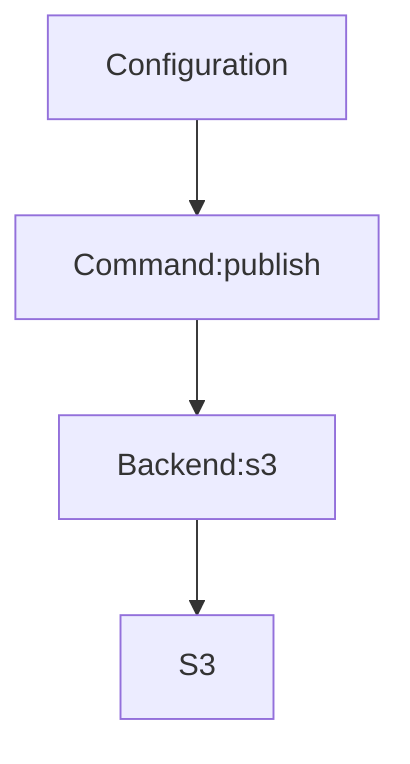

# terrac

A simple CLI tool to quickly setup a minimal private terraform module registry with your cloud storage service.

[](https://npmjs.org/package/oclif-hello-world)
[](https://github.com/oclif/hello-world/blob/main/package.json)
[](https://github.com/haoliangyu/terrac/actions/workflows/main.yaml)

<!-- toc -->
* [Why](#why)
* [Design](#design)
* [Installation](#installation)
* [Configuration](#configuration)
* [Commands](#commands)
* [Backends](#backends)
* [Limitations](#limitations)
* [Roadmap](#roadmap)
<!-- tocstop -->

## Why
<!-- why -->

Sharing terraform module privately is usually necessary when the infrastructure development happens across multiple teams (DevOps vs applications) or multiple repositories (core vs. app infrastructure). 

While a module can be downloaded from a git URL, it lacks the support to code versionization and storage management. While other paid solutions (like [Terraform Cloud](https://developer.hashicorp.com/terraform/cloud-docs/registry)) or open-source solutions (like [citizen](https://github.com/outsideris/citizen)) exist as a full-feature registry, they are usually overkill for small teams, in terms of const, features, or maintenance.

The `terrac` CLI provides a thin layer on your choice of cloud storage service, such as [AWS S3](https://aws.amazon.com/s3/) or [GCP Cloud Storage](https://cloud.google.com/storage/), to publish and share private module code.  It provides features:

* Publish and download with [semver](https://semver.org)
* Manage storage schema and metadata automatically
* Fully integrated with your infrastructure
* Completely serverless (no hosting)
* Simple commands (npm-style)
* Free and flexible

It is suitable to use as a private terraform registry in small teams (while limitations apply).

<!-- whystop -->

## Design
<!-- design -->

The desing of `terrac` consists of three components:
* **Configuration**: a JSON file to provide configurations on the module and the cloud storage service
* **Commands**: a set of commands to provide user interface and interaction
* **Backends**: a set of standard abstractions for different cloud storage services. All backends expose the same interface to the commands and encapuslate the details of interaction with the remote API.



<!-- designstop -->

## Installation
<!-- installation -->
 
### npm

```bash
npm install -g terrac
```
<!-- installationstop -->

## Configuration
<!-- configuration -->

A `terrac.json` file at the module root directory is used to provide configuration for the CLI tool. It contains two objects:
* **backend** to provide the cloud storage configuration
* **module** to provide the module metadata

The JSON configuration can be populated interactively using the `terrac init` command and this is an example:

``` json
{
  "backend": {
    "type": "s3",
    "bucket": "team-sharing",
    "region": "us-east-1"
  },
  "module": {
    "name": "custom-rds-module",
    "version": "1.6.3"
  }
}
```

### Backend

See the [Backends](#backends) section for more details.

### Module

The `module` object describes the meta information for the module to publish:
* **name**: module name
* **version**: module version number. This could be a sematic version or a custom string.

<!-- configurationstop -->

## Commands
<!-- commands -->
* [`terrac hello PERSON`](#terrac-hello-person)

## `terrac hello PERSON`

Say hello

```
USAGE
  $ terrac hello [PERSON] -f <value>

ARGUMENTS
  PERSON  Person to say hello to

FLAGS
  -f, --from=<value>  (required) Who is saying hello

DESCRIPTION
  Say hello

EXAMPLES
  $ oex hello friend --from oclif
  hello friend from oclif! (./src/commands/hello/index.ts)
```

_See code: [dist/commands/hello/index.ts](https://github.com/haoliangyu/terrac/blob/v0.0.0/dist/commands/hello/index.ts)_

<!-- commandsstop -->

## Backends
<!-- backends -->

<!-- backendsstop -->

## Limitations
<!-- limitations -->

<!-- limitationsstop -->

## Roadmap
<!-- roadmap -->

* Features
  * [ ] Add `overwrite` option to the `publish` command
  * [ ] Add `init` command to interatively initialize a module project
  * [ ] Add schema check to the terrac configuration file
  * [ ] Install with brew
  * [ ] Install with bash script
* Backends
  * [ ] GCP Cloud Storage
  * [ ] Azure Blob Storage
* Maintenance
  * [ ] Automate release process
<!-- roadmapstop -->
