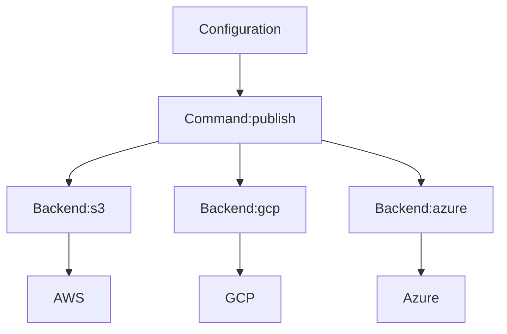

# terrac

A simple CLI tool to quickly setup a minimal private terraform module registry with your cloud storage service.

[](https://npmjs.org/package/terrac)
[](https://github.com/haoliangyu/terrac/blob/main/package.json)
[](https://github.com/haoliangyu/terrac/actions/workflows/main.yaml)

<!-- toc -->

* [Why](#why)
* [Design](#design)
* [Installation](#installation)
* [Tutorial](#tutorial)
* [Configuration](#configuration)
* [Commands](#commands)
* [Backends](#backends)
* [Limitations](#limitations)
* [Roadmap](#roadmap)
* [Development](#development)

<!-- tocstop -->

## Why

<!-- why -->

Sharing terraform module privately is usually necessary when the infrastructure development happens across multiple teams (DevOps vs applications) or multiple repositories (core vs. app infrastructure).

While a module can be downloaded from a git URL, it lacks the support to code versionization and storage management. While other paid solutions (like [Terraform Cloud](https://developer.hashicorp.com/terraform/cloud-docs/registry)) or open-source solutions (like [citizen](https://github.com/outsideris/citizen)) exist as a full-feature registry, they are usually very heavy for small teams, in terms of const, features, or maintenance.

The `terrac` CLI provides a thin layer on your choice of cloud storage service, such as [AWS S3](https://aws.amazon.com/s3/) or [GCP Cloud Storage](https://cloud.google.com/storage/), to publish and share private module code.  It provides features:

* Publish and download with [semver](https://semver.org)
* Manage storage schema and metadata automatically
* Fully integrated with your infrastructure
* Completely serverless (nothing is hosted)
* Simple commands (npm-style)
* Free and flexible

It is suitable to use as a private terraform registry in small teams (while limitations apply).

<!-- whystop -->

## Design

<!-- design -->

The desing of `terrac` consists of three components:

* **Configuration**: a JSON file to provide configurations on the module and the cloud storage service
* **Commands**: a set of commands to provide user interface and interaction
* **Backends**: a set of standard abstractions for different cloud storage services. All backends expose the same interface to the commands and encapuslate the details of interaction with the remote API.



<!-- designstop -->

## Installation

<!-- installation -->

### npm

As a node.js application, terrac can be installed with [npm](https://www.npmjs.com) or other compatible package managers, such as [yarn](https://yarnpkg.com) or [pnpm](https://pnpm.io).

```bash
npm install -g terrac
```

## manual

Binaries for diefferent platforms are provided as attachment at each [GitHub release](https://github.com/haoliangyu/terrac/releases):

* `terrac-linux` for Linux
* `terrac-macos` for MacOS
* `terrac-win.exe` for Windowns

You can simply download a binary and put it in a directoy included in the `PATH` environment variable. Note that administrator permission may be required for the action.

### bash

The following script automates the manual installation with a bash script in Linux and MacOS. `sudo` permission is required.

``` bash
curl https://raw.githubusercontent.com/haoliangyu/terrac/main/scripts/install.sh | bash
```

<!-- tutorial -->

## Tutorial

To initialize a module directory and publish

``` bash
# Create terrac configuration
terrac init

# Pack and publish the module to the remote storage service
terrac publish

# Get the module source URL to use in terraform
terrac get module-name
```

<!-- tutorialstop -->

<!-- installationstop -->

## Configuration

<!-- configuration -->

A `terrac.json` file at the module root directory is used to provide configuration for terrac. It contains two blocks:

* **backend** to provide the cloud storage configuration
* **module** to provide the module metadata

The JSON configuration can be populated interactively using the `terrac init` command and this is an example:

```json
{
  "backend": {
    "type": "s3",
    "bucket": "team-sharing",
    "region": "us-east-1"
  },
  "module": {
    "name": "custom-rds-module",
    "version": "1.6.3"
  }
}
```

### Backend

See the [Backends](#backends) section for more details.

### Module

The `module` object describes the meta information for the module to publish:

* **name**: module name
* **version**: module version number. This could be a sematic version or a custom version name.

<!-- configurationstop -->

## Commands

<!-- commands -->

* [`terrac init`](#terrac-init)
* [`terrac get`](#terrac-get)
* [`terrac list`](#terrac-list)
* [`terrac publish`](#terrac-publish)

### `terrac init`

Initialize terrac configuration in a directory.

```
USAGE
  $ terrac init [--work-directory <value>]

FLAGS
  --work-directory=<value>  [default: .] Root directory of the terraform project

DESCRIPTION
  Initialize terrac configuration in a directory.
```

_See code: [src/commands/init.ts](https://github.com/haoliangyu/terrac/blob/master/src/commands/init.ts)_

### `terrac get`

Get the module source URL with the given module and version.

```
USAGE
  $ terrac get NAME [VERSION] [--work-directory <value>]

ARGUMENTS
  NAME     Module name.
  VERSION  Module version. It could be omitted, or a complete semver.
           If omitted, it will resolve to the latest version.
           If a complete semver is given, it will resolve to the exact version.

FLAGS
  --work-directory=<value>       [default: .] Root directory for the terrac configuration file

DESCRIPTION
  Get the module source URL of the given module and version.

EXAMPLES
  $ terrac get my-module

  $ terrac get my-module 1.2.3
```

_See code: [src/commands/get.ts](https://github.com/haoliangyu/terrac/blob/master/src/commands/get.ts)_

### `terrac list`

List available modules and their versions.

```
USAGE
  $ terrac list [NAME] [--work-directory <value>]

ARGUMENTS
  NAME  Module name

FLAGS
  --work-directory=<value>       [default: .] Root directory for the terrac configuration file

DESCRIPTION
  List available modules and versions.

EXAMPLES
  $ terrac list

  $ terrac list my-module
```

_See code: [src/commands/list.ts](https://github.com/haoliangyu/terrac/blob/master/src/commands/list.ts)_

### `terrac publish`

Publish a terraform module.

```
USAGE
  $ terrac publish [--overwrite] [--work-directory <value>]

FLAGS
  --overwrite                    Overwrite a published version with new package
  --work-directory=<value>       [default: .] Work directory for the module publication

DESCRIPTION
  Publish a terraform module

EXAMPLES
  $ terrac publish
```

_See code: [src/commands/publish.ts](https://github.com/haoliangyu/terrac/blob/master/src/commands/publish.ts)_

<!-- commandsstop -->

## Backends

<!-- backends -->

Terrac supports a variety of storage backends for artifact hosting:
* Local
* AWS S3
* GCP Storage
* Azure Block Storage

To set a backend for module publication, update the `backend` block in the `terrac.json` configuration file.

### Local Directory

The `local` backend type uses a local directory for package storage. It is typically used for local testing.

``` jsonc
// terrac.json
{
  "backend": {
    "type": "local",
    // path to the storage directory
    "path": "./"
  }
}
```

### AWS S3

The `s3` backend type uses an [AWS S3](https://aws.amazon.com/s3/) bucket for artifact storage. It utilizes the AWS SDK for JavaScript to communicate with AWS and requires proper authentication setup (see [documentation](https://docs.aws.amazon.com/sdk-for-javascript/v3/developer-guide/setting-credentials-node.html)).

``` jsonc
// terrac.json
{
  "backend": {
    "type": "s3",
    // bucket name
    "bucket": "module-bucket",
    // bucket region
    "region": "us-east-1"
  }
}
```

### GCP Cloud Storage

The `gcp` backend type uses a [GCP Cloud Storage](https://cloud.google.com/storage) bucket for artifact storage. It uses the GCP Node.js SDK to communicate with GCP and requires proper authentication setup (see [documentation](https://cloud.google.com/docs/authentication/provide-credentials-adc)).

``` jsonc
// terrac.json
{
  "backend": {
    "type": "gcp",
    // bucket name
    "bucket": "module-bucket",
    // project id
    "projectId": "my-module-registry"
  }
}
```

### Azure Blob Storage

The `azure` backend type uses a [Azure Blog Storage](https://azure.microsoft.com/en-us/products/storage/blobs) container for artifact storage.

``` jsonc
// terrac.json
{
  "backend": {
    "type": "azure",
    // Azure storage account name
    "account": "terrac",
    // Azure storage container name
    "conatiner": "terrac-test",
    // [Optional] File name prefix
    "fileNamePrefix": "name/prefix"
  }
}
```

<!-- backendsstop -->

## Limitations

<!-- limitations -->

The purpose of `terrac` is to provide a consistent and simple interface for terraform module hosting with a variety of storage backends. It focuses on the module publication and download. However, it doesn't provide or guarantee some advanced features of modern artifact registry, such as:
* Authentication
* High availability
* High scalability
* Atomic write
* Conflict control
* Permission control

It may be possible to configure a storage backend for these features but this is out of the scope of this project.

<!-- limitationsstop -->

## Roadmap

<!-- roadmap -->

* Features
   * [x] Add `overwrite` option to the `publish` command
   * [x] Add `init` command to interatively initialize a module project
   * [x] Add schema check to the terrac configuration file
   * [x] Add support to any custom version name in the `get` and `publish` commands
   * [ ] Add support to using partial semver in the `get` and `list` commands
   * [ ] Add support to [OpenTofu](https://opentofu.org)
   * [ ] Install with brew
   * [x] Install with bash script
   * [x] Install with standalone executable in different OS
   * [ ] Use backend configuration schema to configure `init` command questionnaire

* Backends
   * [x] GCP Cloud Storage
   * [x] Azure Blob Storage

* Maintenance
  * [ ] Unit tests for `init` command
  * [ ] Automate release process to cut GitHub release

<!-- roadmapstop -->

## Development

<!-- development -->

In order to run tests locally, it requires the following packages to be installed:
* [localstack](https://github.com/localstack/localstack#installation)
* [awscli-local](https://github.com/localstack/awscli-local)

<!-- developmentstop -->
